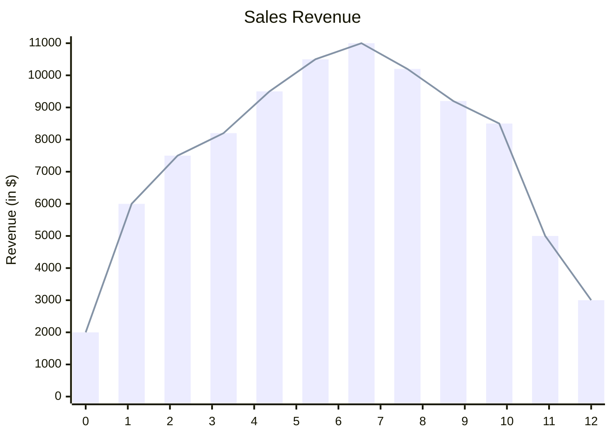
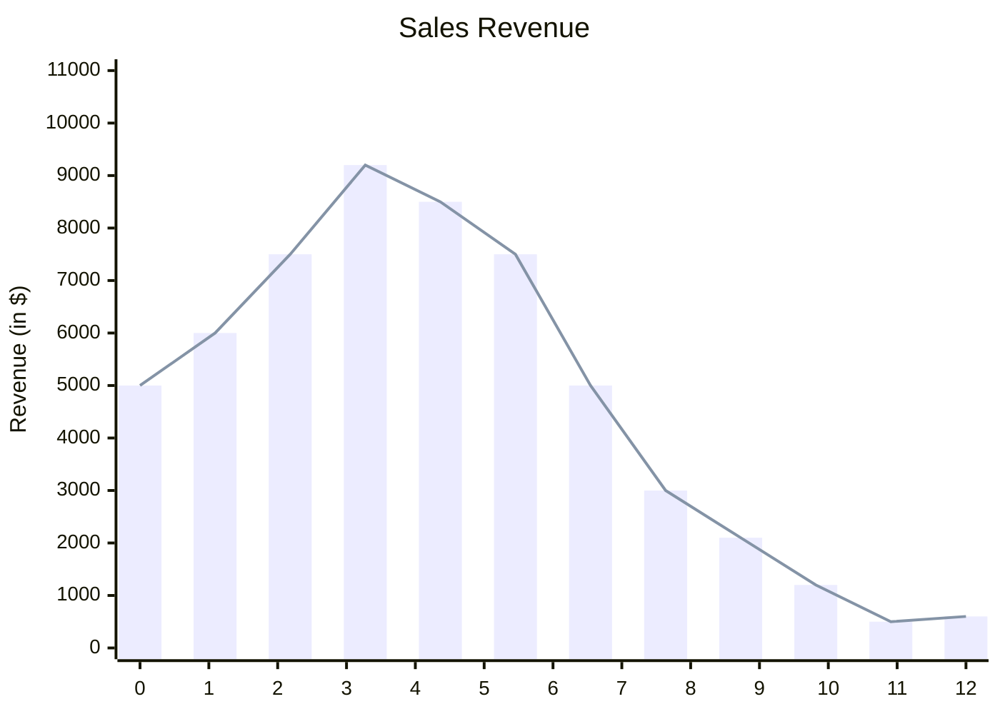
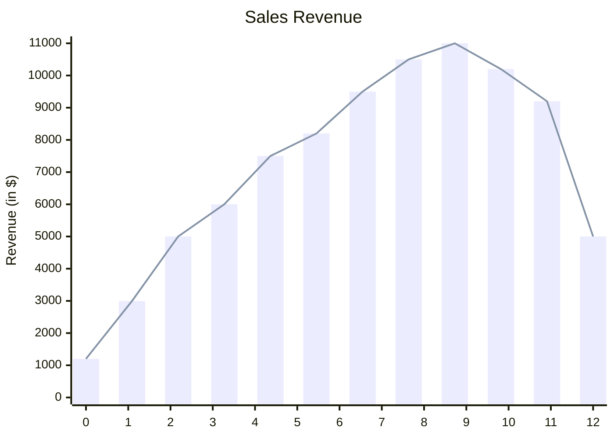

::li::
- To be able to identify and interpret the shape of data distribution.
- To understand the implications of different distribution shapes on data analysis and modeling.

::sc::
- Identify the shape of the given data distribution using visualizations in Excel

---
layout: center
---

# Measures of Shape

(from the Australian Bureau of Statistics)

Measures of shape describe the distribution (or pattern) of the data within a dataset.

The distribution shape of quantitative data can be described as there is a logical order to the values, and the 'low' and 'high' end values on the  x-axis of the histogram are able to be identified. 

The distribution shape of a qualitative data cannot be described as the data are not numeric.

|Shape|Description|
|---|---|
|Symmetrical|The left and right sides of the distribution are mirror images of each other.|
|Positively skewed|The tail on the right hand side of the histogram is longer than the left side. More of the values cluster towards the smaller end of the x axis.|
|Negatively skewed|The tail on the left hand side of the histogram is longer than the right side. More of the values cluster towards the larger end of the x axis.|

---
layout: center
---

# Symmetrical Distribution

Note: The left and right sides are very close to being mirror images of each other. They aren't exactly the same, but there is a clear pattern.

---
layout: center
---
# Positively Skewed Distribution

Note: The tail on the right hand side of the histogram is longer than the left side. More of the values cluster towards the smaller end of the x axis.

---
layout: center
---
# Negatively Skewed Distribution

Note: The tail on the left hand side of the histogram is longer than the right side. More of the values cluster towards the larger end of the x axis.

---
layout: center
---

# Creating a Histogram in Excel

1. Select the data you want to create a histogram for.
2. Click on the "Insert" tab in the Excel ribbon.
3. In the Charts group, click on the "Insert Statistic Chart" button.