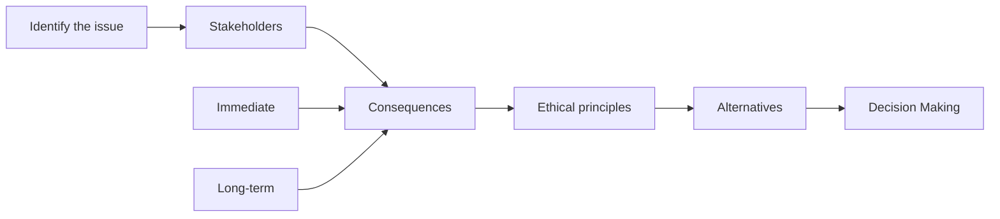

# Ethics in Data Analytics

---
layout: cover
---

# Ethics in Data Analytics

From the 2024 VCE Data Analytics Study Design:

- ethical issues arising from the implementation of data and information security practices, including:
    - data collection and use
    - identity theft
    - lack of transparency in the event of a cyber security incident

---
layout: center
zoom: 0.9
---

# A simple ethical framework

- **Who are the stakeholders?**
    - Who will be affected by the decision or action?
- **What are the potential consequences?**
    - What are the possible outcomes of the decision or action?
    - Who experiences harm or benefit?
- **What are the ethical principles involved?**
    - Consider principles such as honesty, fairness, respect for privacy, and responsibility.
- **What alternatives are there for action?**
    - Are there other ways to achieve the same goal that may be more ethical?

---
layout: center
---

# Data Collection and Use (Examples of following the framework)

- Issue: Potential issues with how data is collected, stored, and used.
- Stakeholders: Individuals whose data is being collected, organisations collecting the data, and third parties accessing the data.
- Consequences: Potential harm to individuals' privacy, misuse of data, and loss of trust in organisations.
- Ethical Principles: Respect for privacy, transparency, and informed consent.
- Alternatives: Implementing clear data collection policies, obtaining informed consent, and ensuring data security.

---
layout: center
---

# Identity Theft (Examples of following the framework)

- Issue: Risks associated with identity theft due to data breaches or inadequate authentication measures.
- Stakeholders: Individuals whose identities may be stolen (and their families or friends), organisations responsible for data security, and law enforcement agencies.
- Consequences: Financial loss, emotional distress, and damage to reputation for individuals; legal, reputational and financial repercussions for organisations. 
- Ethical Principles: Responsibility, accountability, and protection of personal information.
- Alternatives: Implementing robust authentication measures, educating users about identity theft, and having clear protocols for responding to data breaches.

---
layout: center
---

# Lack of Transparency in the Event of a Cyber Security Incident (Examples of following the framework)

- Issue: Organisations failing to be transparent about cyber security incidents, leading to mistrust and potential harm to affected individuals.
- Stakeholders: Affected individuals, organisations experiencing the incident, regulatory bodies, and the general public.
- Consequences: Loss of trust, legal consequences, and potential harm to individuals if they are not informed about risks to their data.
- Ethical Principles: Honesty, transparency, and accountability.
- Alternatives: Establishing clear communication protocols for cyber security incidents, being transparent about the nature and impact of incidents, and providing support to affected individuals.

---