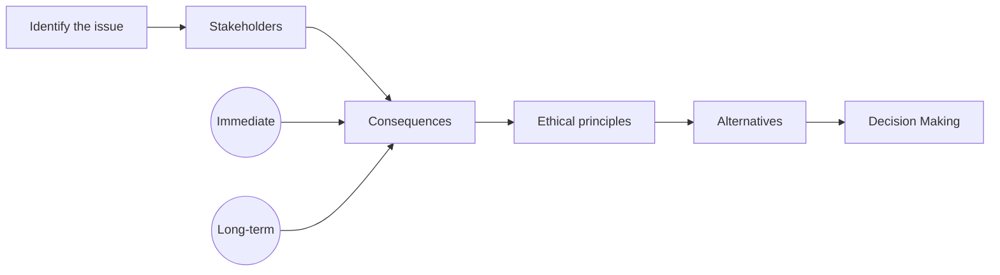

# Ethics in Data Analytics

---
layout: two-cols
zoom: 0.9
---

# Revision Question: SQL 

Use the sample rows from the database tables to the right, write an SQL query to find:

1. The name and price of each item.
2. The total price for each order (quantity * price), for all orders.
3. The total revenue for all orders of the Broom (item_id = 101).

::right::

*ORDERS Table:*
| order_id | item_id | order_date | quantity |
|----------|-------------|------------|--------|
| 1        | 101         | 2023-01-15 | 3 |
| 2        | 102         | 2023-01-16 | 2 |
| 3        | 101         | 2023-01-17 | 1 |

*ITEMS Table:*

| item_id | item_name     | price |
|---------|---------------|-------|
| 101     | Broom         | 10.00 |
| 102     | Mop           | 15.00 |

---
layout: cover
---

# Ethics in Data Analytics

From the 2024 VCE Data Analytics Study Design:

- ethical issues arising from the implementation of data and information security practices, including:
    - data collection and use
    - identity theft
    - lack of transparency in the event of a cyber security incident

---
layout: center
zoom: 0.9
---

# A simple ethical framework

- **Who are the stakeholders?**
    - Who will be affected by the decision or action?
- **What are the potential consequences?**
    - What are the possible outcomes of the decision or action?
    - Who experiences harm or benefit?
- **What are the ethical principles involved?**
    - Consider principles such as honesty, fairness, respect for privacy, and responsibility.
- **What alternatives are there for action?**
    - Are there other ways to achieve the same goal that may be more ethical?
    - Is there a way to mitigate potential harm or enhance benefits?

---
layout: center
zoom: 1.2
---

# Data Collection and Use
#### (Examples of following the framework)

<v-clicks>

- **Issue:** Potential issues with how data is collected, stored, and used.
- **Stakeholders:** Individuals whose data is being collected, organisations collecting the data, and third parties accessing the data.
- **Consequences:** Potential harm to individuals' privacy, misuse of data, and loss of trust in organisations.
- **Ethical Principles:** Respect for privacy, transparency, and informed consent.
- **Alternatives:** Implementing clear data collection policies, obtaining informed consent, and ensuring data security.

</v-clicks>
---
layout: center
zoom: 1.2
---

# Identity Theft 
#### (Examples of following the framework)

<v-clicks>

- **Issue:** Risks associated with identity theft due to data breaches or inadequate authentication measures.
- **Stakeholders:** Individuals whose identities may be stolen (and their families or friends), organisations responsible for data security, and law enforcement agencies.
- **Consequences:** Financial loss, emotional distress, and damage to reputation for individuals; legal, reputational and financial repercussions for organisations. 
- **Ethical Principles:** Responsibility, accountability, and protection of personal information.
- **Alternatives:** Implementing robust authentication measures, educating users about identity theft, and having clear protocols for responding to data breaches.

</v-clicks>

---
layout: center
zoom: 1.1
---

# Lack of Transparency in the Event of a Cyber Security Incident 
#### (Examples of following the framework)

<v-clicks>

- **Issue:** Organisations failing to be transparent about cyber security incidents, leading to mistrust and potential harm to affected individuals.
- **Stakeholders:** Affected individuals, organisations experiencing the incident, regulatory bodies, and the general public.
- **Consequences:** Loss of trust, legal consequences, and potential harm to individuals if they are not informed about risks to their data.
- **Ethical Principles:** Honesty, transparency, and accountability.
- **Alternatives:** Establishing clear communication protocols for cyber security incidents, being transparent about the nature and impact of incidents, and providing support to affected individuals.

</v-clicks>

---
layout: center
zoom: 1.2
---

# Summary

- When discussing ethical issues - we focus on:
    - Who are the **stakeholders**?
    - What are the potential **consequences**?
    - What are the ethical **principles** involved?
    - What **alternatives** are there for action?
- Avoid using legal arguments in ethical questions
- Common sense is a useful guide in responding to ethical issues, but be sure to also *consider perspectives that may be different from your own*.

---
layout: center
zoom: 1.2
hideInToc: false
---

# Your SAC

82 marks

Each response should be related back to the case study provided wherever possible.

Generic answers (e.g. "data should be kept private") are unlikely to score at all.

Plan your time out: if you find yourself spending too long on one question, move on and come back to it later if you have time. Make sure you have a response for every question - **the first mark in a question is usually the easiest to get.**