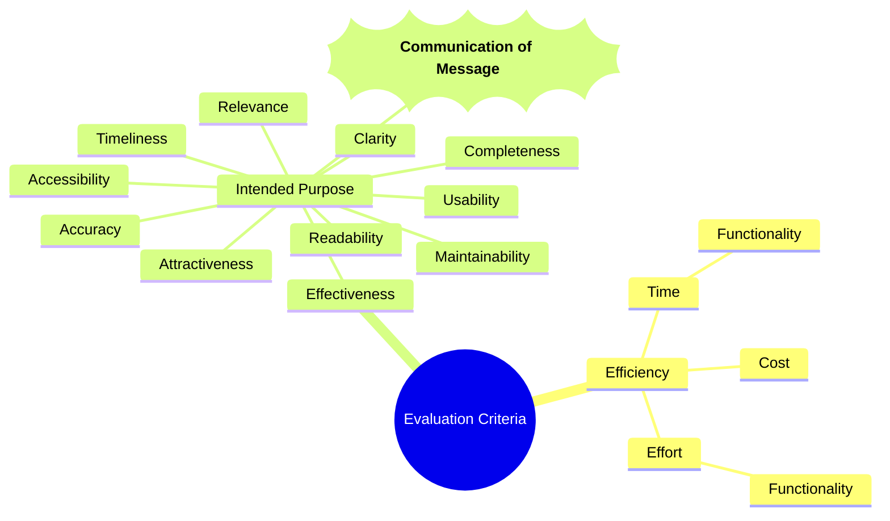

# Creating Evaluation Criteria

---
layout: li
---

::li::
- To be able to define the difference between efficiency and effectiveness in data visualisations, spreadsheets and databases
- To be able to create efficiency and effectiveness criteria for design ideas

::sc::
- Create my own evaluation criteria for the SAT

---
layout: two-cols-header
---

# Efficiency and Effectiveness

*VCAA Definitions - VCE Applied Computing Study Design 2025 p. 14*

::left::

**Efficiency**

A measure of how much time, cost and effort is applied to achieve intended results.  Measures of efficiency in a solution could include the cost of data and file manipulation, its functionality and the speed of processing.  Measures of efficiency in a network include its productivity, processing time, operational costs and level of automation.

::right::

**Effectiveness**

A measure of how well solutions, designs, data and information security strategies and development practices function, and the degree to which they achieve their intended purpose. Effectiveness measures for solutions and designs include accessibility, accuracy, attractiveness, clarity, communication of message, completeness, maintainability, readability, relevance, timeliness and usability. Effectiveness measures for data and information security strategies include confidentiality, integrity and availability. Effectiveness measures for development practices include security controls in place, exposure to vulnerability and risk, and legal compliance.

---
layout: center
---

# Evaluation Criteria

- Evaluation criteria are the standards by which a design idea or solution is judged
- In applied computing, evaluation criteria are used to assess the **efficiency and effectiveness** of a design idea or solution
- We can use evaluation criteria to compare two or more design ideas or solutions to determine which is the best fit for a particular problem or situation
- Evaluation criteria can be used to assess the quality of a design idea or solution, and to identify areas for improvement

**How we will use the evaluation criteria in the SAT**
- In the SAT, you will be required to create your own evaluation criteria for your design ideas **(in Criterion 4)**
- You will use these evaluation criteria to assess the efficiency and effectiveness of your design ideas and select which ideas should be further developed **(Criterion 4)**
- You will also use these evaluation criteria to complete the evaluation of your final solution in Unit 4 **(Criterion 10)**

---
layout: center
---

# Efficiency and Effectiveness Mind Map

---
layout: center
---
# Creating Evaluation Criteria - A Thinking Process

- Start with thinking about the application of efficiency and effectiveness in the context of your design ideas
    - What would make these design ideas efficient?
    - What would make these design ideas effective?
- Keep your criteria as measurable as possible:
    - Use specific metrics or standards to define what you mean by efficiency and effectiveness
    - Avoid vague terms like "good" or "bad" and instead try to use specific criteria that can be objectively measured
- Consider your audience, research question and your technology approach. 