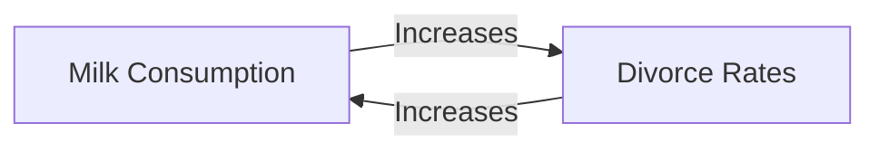

# Correlation in Spreadsheets

---
layout: center
class: text-center
zoom: 1.4
---

# Do Now

Answer on the whiteboard table

What does it mean if two variables are correlated?

What is the difference between positive and negative correlation?

---
layout: li
---

::li::
- To be able to describe the concept of correlation between two variables
- To be able to calculate the correlation coefficient between two variables using spreadsheets
- To be able to interpret the correlation coefficient between two variables

::sc::
- Describe the concept of correlation between two variables
- Use Excel to calculate the correlation coefficient
- Interpret the correlation coefficient meaningfully

---
layout: center
---

# Correlation

Correlation is a statistical measure that describes the extent to which two variables are related.
- A positive correlation means that as one variable increases, the other variable also increases.
- A negative correlation means that as one variable increases, the other variable decreases.
- Correlation describes a general pattern of the data

## Examples of Correlation

<v-clicks>

- Height and weight
- Seatbelt usage rates and traffic fatalities
- Hours studied and exam score
- Temperature and ice cream sales

</v-clicks>
---
layout: center
---
# Correlation

What do we think is happening?

---
layout: cover
---

# Correlation does not imply causation!

Just because two variables are correlated does not mean that one variable causes the other to change.

---
layout: center
---

# Pearson's Correlation Coefficient - `r`

Pearson's correlation coefficient (usually labelled as `r`) is a measure of the strength and direction of the linear relationship between two **numeric variables**.

- r = 1 means a perfect positive correlation
- r = -1 means a perfect negative correlation
- r = 0 means no correlation
- r is a number between -1 and 1

---
layout: center
zoom: 1.3
---

# Correlation Coefficient in Excel
 

`=CORREL(array1, array2)`

- `array1` is the first set of data
- `array2` is the second set of data
- Both arrays must be the same size

eg. 

`=CORREL(A2:A20, B2:B20)`

---
layout: center
---

# Discuss

Estimate the correlation coefficient between the two variables in the tables below.

1. Hours studied and exam score

| Hours Studied | Exam Score |
|---------------|------------|
| 1             | 50         |
| 2             | 60         |
| 3             | 70         |
| 4             | 80         |
| 5             | 90         |

2. Cars sold and advertising spend

| Cars Sold | Advertising Spend |
|-----------|------------------|
| 3         | 1000             |
| 4         | 2500             |
| 6         | 5000             |
| 7         | 7000             |
| 10        | 6000             |

---
layout: center
---
# Strength

- The strength of a relationship between two variables is determined by the value of r.
- Values close to 1 or -1 indicate a strong linear relationship.
- Strength can be described as:
  - Strong: r > 0.75 or r < -0.75
  - Moderate: 0.5 < r < 0.75 or -0.75 < r < -0.5
  - Weak: 0.25 < r < 0.5 or -0.25 > r > -0.5
  - No relationship: -0.25 < r < 0.25
- The strength of a relationship can be affected by outliers.

---
layout: center
---

# Direction

- The direction of a relationship is determined by the sign of r.
- A positive value of r indicates a positive linear relationship.
- A negative value of r indicates a negative linear relationship.

---
layout: center
---

# Your Turn

Open the Lego dataset spreadsheet from the previous lesson. 

1. Would you expect there to be a correlation between the year and the number of pieces in the set? Give a reason for your answer.
2. Use Excel to calculate the correlation coefficient between the year and the number of pieces in the set.
3. Interpret the correlation coefficient. What does it mean? Identify the strength and direction of the correlation, as well as articulating what that means in the context of the data.

(10 mins)
---